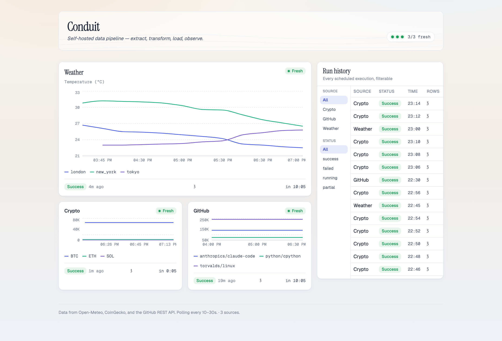
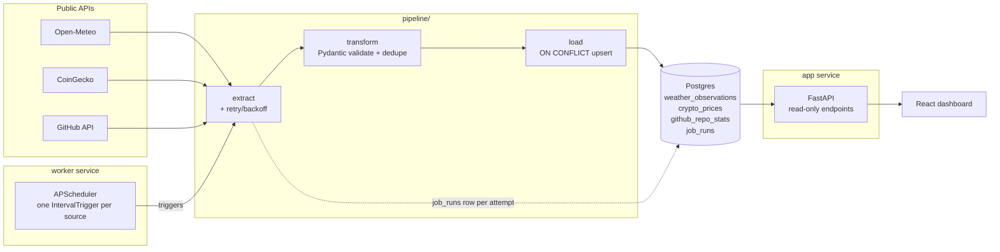
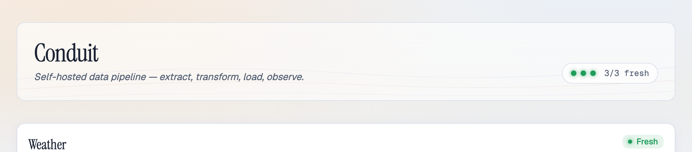

# Conduit

A self-hosted, containerized data pipeline: pulls data from public APIs on a
schedule, transforms and validates it, loads it into Postgres with
idempotent upserts, and exposes it through a read-only API and a dashboard.

Third in a series of portfolio projects (after Sift — a RAG API — and
Pulse — a real-time WebSocket dashboard). This one is about data
engineering and DevOps: ETL correctness, idempotency, observability,
scheduling, and a pluggable source abstraction that's proven, not just
claimed.



*Real screenshot, real data — the weather tile above three real cities,
crypto and GitHub tiles, and the run-history ledger are all pulling live
from Open-Meteo, CoinGecko, and the GitHub REST API through the actual
running app. Not a mockup.*

## Contents

- [Architecture](#architecture)
- [Why APScheduler, not Prefect](#why-apscheduler-not-prefect)
- [Database schema](#database-schema)
- [Idempotency strategy](#idempotency-strategy)
- [Data freshness](#data-freshness)
- [Adding a new source](#adding-a-new-source--the-real-diff)
- [API](#api)
- [Frontend](#frontend)
- [Running it](#running-it)
- [Docker — what's verified and what isn't](#docker--whats-verified-and-what-isnt)
- [Real run, real data](#real-run-real-data)
- [Tests, linting, types](#tests-linting-types)

## Architecture



Three services share one codebase and image: `app` (FastAPI, read-only),
`worker` (APScheduler — same scheduling code, no HTTP server), and `db`
(Postgres). Splitting scheduler from API means restarting the API doesn't
interrupt in-flight jobs, and running two `app` replicas behind a load
balancer someday wouldn't double-trigger extraction — only `worker` calls
`build_scheduler()`.

```
pipeline/
  sources/        Source implementations (base.py = the Protocol)
  extract/        run_job(): extract -> transform -> load, records job_runs
  transform/       generic normalize() -- validates + dedupes, source-agnostic
  load/            generic upsert() -- ON CONFLICT DO UPDATE, source-agnostic
  models.py        SQLAlchemy models: 3 data tables + job_runs
  scheduler.py     APScheduler wiring, one interval trigger per source
  worker.py        standalone entrypoint that just runs the scheduler
  registry.py      the one file a new source gets wired into
  retry.py         shared exponential-backoff decorator
  freshness.py     fresh/stale/critical classification from job_runs
app/
  main.py          FastAPI app + lifespan (starts scheduler only if
                    CONDUIT_RUN_SCHEDULER=true, i.e. local dev)
  routers/         sources, data, runs, health endpoints
frontend/          Vite + React + TS + Tailwind dashboard
alembic/           one migration, full schema
tests/             pytest — see "Tests, linting, types"
scripts/           demo_*.py -- the scripts used to produce every real
                   output quoted in this README
```

## Why APScheduler, not Prefect

Conduit's jobs are independent, single-step, source-scoped ETL runs on
their own schedules — there's no cross-source DAG, no need for a
distributed task queue, and no team of humans who need a shared
orchestration UI. Prefect earns its weight when you have multi-step flows
with real dependencies between them, retries that need to survive a
process crash, or a server + UI that several people rely on for
visibility. None of that is true here.

APScheduler running in-process gives per-source interval triggers for
free, and I need retry/backoff and execution history (`job_runs`) either
way — building those myself on top of a lightweight scheduler was less
total machinery than standing up Prefect's server and orchestration
database just to get a UI I'd then partially replace with a custom
frontend anyway.

## Database schema

```sql
weather_observations (location_id, observed_at, temperature_c, humidity_pct,
                       wind_speed_ms, raw jsonb, fetched_at)
  UNIQUE (location_id, observed_at)

crypto_prices (asset_symbol, observed_at, price_usd, volume_24h,
               market_cap, raw jsonb, fetched_at)
  UNIQUE (asset_symbol, observed_at)

github_repo_stats (repo_full_name, observed_at, stars, open_issues,
                    forks, language, raw jsonb, fetched_at)
  UNIQUE (repo_full_name, observed_at)

job_runs (source_id, scheduled_for, attempt, started_at, finished_at,
          status, rows_extracted, rows_loaded, error)
  INDEX (source_id, started_at DESC)
```

One migration (`alembic/versions/30e4061321b3_*.py`) creates all four
tables — the schema was designed and approved up front (see commit
`7b7f316`), rather than growing table-by-table as sources were added.
`alembic check` reports no drift against the current models.

**`raw jsonb` is on every source table on purpose**: it's the exact,
unmodified API payload for that row, so a bad transform can be debugged
or replayed without re-hitting the upstream API — useful the first time
CoinGecko changes a field name under you. At larger scale I'd age `raw`
out of the hot table after N days into cold/object storage (S3 + a TTL)
instead of keeping every payload indefinitely, since it dominates row
size and is almost never read after the first debugging pass.

## Idempotency strategy

Every table's natural key is `(entity_id, observed_at)` — but what
`observed_at` *means* deliberately differs by source, and that difference
is the whole idempotency story:

- **Weather and crypto**: the upstream API returns a real timestamp per
  data point (Open-Meteo's `current.time`, CoinGecko's
  `last_updated_at`). `observed_at` is that timestamp. A retried fetch
  naturally re-upserts the same row.
- **GitHub**: the repo API has no history — every call returns the
  *current* star/issue/fork counts, with no timestamp of its own. If
  `observed_at` were wall-clock fetch time, every retry would produce a
  *new* row instead of correcting a failed one. So `observed_at` is the
  scheduler's **logical run slot** instead
  (`pipeline.time_utils.truncate_to_interval` — `now` floored to the
  source's interval boundary).

**Concrete example**: a GitHub job is scheduled for `14:00:00`. The first
attempt gets a 500 and `@with_backoff` retries ~2s later. Both attempts
run with `run_slot = 14:00:00`, so both produce a record with
`observed_at = 14:00:00` — the retry's `INSERT ... ON CONFLICT
(repo_full_name, observed_at) DO UPDATE` overwrites the same row instead
of inserting a second one. Re-running the whole job by hand for that same
slot later is likewise a no-op change, not a duplicate.

This is proven, not just asserted — `tests/test_idempotency.py` runs the
same extraction+load twice against a real Postgres instance and asserts
the row count is unchanged *and* that changed values actually get written
(so it's catching a silent no-op, not just an accidental pass):

```
$ pytest tests/test_idempotency.py -v
test_rerunning_same_job_does_not_duplicate_rows PASSED
test_rerun_with_changed_values_updates_in_place_not_duplicates PASSED
test_job_runs_records_one_row_per_attempt_even_when_idempotent PASSED
```

## Data freshness

Computed live from `job_runs` on every request (`pipeline/freshness.py`),
not stored as a column — so it's always consistent with actual execution
history:

| status | condition |
|---|---|
| 🟢 fresh | last success within 1× the source's `interval_seconds` |
| 🟡 stale | last success within 1×–3× interval |
| 🔴 critical | last success beyond 3× interval, or never succeeded |

## Adding a new source — the real diff

Per source, `transform` and `load` are completely generic — they operate
only on the `record_model` / `table` / `natural_key` ClassVars a `Source`
declares. The claim is that adding source #3 (GitHub — deliberately a
different *shape*: categorical + numeric snapshot, not another
time-series-of-measurements source) touches nothing else.

That's not just asserted here — it's a real, inspectable `git diff`
between the commit made right after crypto (source #2) was finished and
the commit that added GitHub:

```
$ git diff --stat b66f427 6a0ef6e
 pipeline/registry.py           |  9 ++++
 pipeline/sources/github.py     | 95 ++++++++++++++++++++++++++++++++
 scripts/demo_github_extract.py | 30 +++++++
 scripts/demo_github_run.py     | 50 +++++++++++
 tests/test_github_source.py    | 54 +++++++++++
 5 files changed, 238 insertions(+)

$ git diff --name-status b66f427 6a0ef6e
M       pipeline/registry.py
A       pipeline/sources/github.py
A       scripts/demo_github_extract.py
A       scripts/demo_github_run.py
A       tests/test_github_source.py
```

One modified file, and it's a two-line addition:

```diff
--- a/pipeline/registry.py
+++ b/pipeline/registry.py
@@
 from pipeline.sources.base import Source, SourceConfig
 from pipeline.sources.crypto import CryptoSource
+from pipeline.sources.github import GithubSource
 from pipeline.sources.weather import WeatherSource
@@
             extra={"assets": {"bitcoin": "BTC", "ethereum": "ETH", "solana": "SOL"}},
         ),
     ),
+    "github": (
+        GithubSource,
+        SourceConfig(
+            source_id="github",
+            interval_seconds=1800,
+            extra={"repos": ["torvalds/linux", "python/cpython", "anthropics/claude-code"]},
+        ),
+    ),
 }
```

Nothing in `pipeline/transform`, `pipeline/load`, `pipeline/extract`,
`pipeline/scheduler.py`, or the API layer changed. The app's data-query
endpoints picked GitHub up automatically too — `app/data_registry.py`
reads straight from `pipeline.registry.SOURCES`.

**The real walkthrough**, if you're adding a fourth source yourself:

1. Create `pipeline/sources/<name>.py`: a class with `source_id`,
   `record_model` (a Pydantic model), `table` (a SQLAlchemy table),
   `natural_key` (a tuple of column names), and `extract()` / `parse()`.
   Decide whether your upstream has real per-record history (key
   `observed_at` off its own timestamp) or only a live snapshot (key off
   `run_slot`, like GitHub).
2. Add its table + migration: a `Base` subclass in `pipeline/models.py`
   with a `UniqueConstraint` on your natural key, then
   `alembic revision --autogenerate -m "..."` and `alembic upgrade head`.
3. Register it: one import + one dict entry in `pipeline/registry.py`.
4. Write a `tests/test_<name>_source.py` contract test against a captured
   real payload (see any existing one for the pattern).

That's it — nothing else needs to change for it to be scheduled, loaded
idempotently, queryable via the API, and visible in the frontend (the
frontend needs one entry in `frontend/src/lib/sourceConfig.ts` to know
which field to chart).

## API

| Endpoint | Description |
|---|---|
| `GET /health` | liveness + a real DB round-trip |
| `GET /api/sources` | per-source config + live freshness |
| `GET /api/data/{source_id}` | filterable by `start`/`end`, paginated |
| `GET /api/data/{source_id}/export.csv` | CSV export |
| `GET /api/runs` | job run history, filterable by `source_id`/`status` |

## Frontend

Vite + React + TypeScript + Tailwind. Went through two design passes —
worth being honest about both, since the second one changed real
structure, not just colors.

**Pass 1** was a dark graphite theme (Fraunces/Inter/IBM Plex Mono,
three stacked full-width sections: health table, chart row, run-history
table) — functionally complete but visually generic. **Pass 2**
("Dusk Sky", current) rebuilt the palette, type, and layout on direct
feedback that the first pass felt too ordinary:



- **Palette** — a warm alabaster base blending into pale sky, one cool
  indigo accent for primary actions plus one warm terracotta accent used
  sparingly (the next-run countdown, the active filter-rail tab) — the
  warm/cool tension is deliberate, meant to read as more considered than
  a stock light SaaS theme, without leaning on literal weather imagery
  (no sun icon, no cartoon cloud).
- **Type** — Instrument Serif for the wordmark and tile headings, Geist
  + Geist Mono for UI chrome and data/timestamps.
- **Layout** — an asymmetric bento grid instead of stacked full-width
  sections: a compact glowing "pulse strip" in the masthead (dots, not a
  stat-number row) shows fresh/stale/critical at a glance; each source
  gets one `SourceTile` merging what used to be a separate health-table
  row and a separate chart tile (hero-sized for weather, compact for
  crypto/github); run history is a side ledger with a vertical
  source/status filter rail and its own internal scroll, not a
  full-width table with dropdowns.
- One decorative touch: faint layered horizon-arc SVG behind the
  masthead (`Atmosphere.tsx`, `aria-hidden`, no data) — abstract
  altitude lines, not a literal sky icon.

Status colors are muted/tinted, not saturated stock red/green, and
always paired with a dot + label — never color alone. Both the status
triplet and the chart's categorical triplet (indigo/aqua/violet) were
re-validated against the light surface with
`dataviz/scripts/validate_palette.js` after the palette changed, rather
than eyeballed.

The one animated touch, both passes: the freshness dot gets a very slow
(3.6s), low-amplitude glow when a source is fresh —
`prefers-reduced-motion` turns it off. Nothing else animates.

Panels (same functional coverage as the original spec, different
arrangement):
- **Pipeline health** — folded into each `SourceTile`: freshness badge,
  last run status/age, rows processed, and a live countdown (ticking
  every second) to the next scheduled run
- **Recent values** — a Recharts time-series per source, multi-line by
  entity (location / asset / repo), embedded directly in its tile
- **Run history** — side ledger, filterable by source and status via the
  vertical rail

## Running it

### Locally, without Docker

```bash
python3 -m venv .venv && source .venv/bin/activate
pip install -e ".[dev]"

# Postgres running locally on 5433 in this example
createdb -h localhost -p 5433 conduit
export DATABASE_URL="postgresql+asyncpg://conduit@localhost:5433/conduit"
alembic upgrade head

uvicorn app.main:app --reload   # scheduler runs in-process by default locally

cd frontend && npm install && npm run dev
```

### With Docker

```bash
docker compose up --build
```

Brings up `db` (Postgres 16), `app` (FastAPI, runs migrations on start),
`worker` (APScheduler, separate from the API process), and `frontend`
(nginx serving the built dashboard, proxying `/api` and `/health` to
`app`). See the caveat below on what this has and hasn't been verified
against.

## Docker — what's verified and what isn't

This development environment cannot run a Docker daemon (`colima`
requires `qemu`, which fails to build from source on this host's macOS
12) — so **`docker compose up` has not been run end-to-end**, and I'm
saying that plainly instead of claiming otherwise.

What *is* verified:
- `docker compose config` validates the compose file cleanly (service
  wiring, env vars, healthchecks, dependency ordering all parse).
- Every piece the compose file wires together — each of the three
  sources, the scheduler/worker split (`pipeline/worker.py` run standalone
  with `SIGTERM` handling), the FastAPI app with the scheduler disabled
  via `CONDUIT_RUN_SCHEDULER=false`, and the Alembic migration — was run
  and verified independently against a real, natively-installed
  Postgres 16 instance (not Docker's Postgres, but the same engine,
  same SQL).
- The frontend's production build (`npm run build`) succeeds and was
  screenshotted running against the live FastAPI backend.

If you're reviewing this on a machine with a working Docker daemon,
`docker compose up --build` should work as written — please open an
issue if it doesn't.

## Real run, real data

All output below is from actually running the scripts in `scripts/`
against live public APIs and a real local Postgres — not fabricated
example output.

**Weather** (Open-Meteo, no API key):
```
$ python scripts/demo_weather_run.py
=== RUN 1 (first extraction for this run_slot) ===
status=success rows_extracted=2 rows_loaded=2
weather_observations row count: 2

=== RUN 2 (re-run for the SAME run_slot — idempotency check) ===
status=success rows_extracted=2 rows_loaded=2
weather_observations row count: 2
row count unchanged: True

=== Loaded rows ===
london     observed_at=2026-08-08 19:00:00+00:00 temp_c=26.7 humidity_pct=26 wind_ms=2.89
new_york   observed_at=2026-08-08 19:00:00+00:00 temp_c=30.8 humidity_pct=63 wind_ms=4.17
```

**Crypto** (CoinGecko, no API key):
```
$ python scripts/demo_crypto_run.py
=== RUN 1 ===
status=success rows_extracted=3 rows_loaded=3
crypto_prices row count: 3
=== RUN 2 (re-run, idempotency check) ===
status=success rows_extracted=3 rows_loaded=3
crypto_prices row count: 3
row count unchanged: True

=== Loaded rows ===
BTC   observed_at=2026-08-08 20:05:50+00:00 price_usd=65029 market_cap=1304976895065.25 volume_24h=12428180617.21
ETH   observed_at=2026-08-08 20:05:50+00:00 price_usd=1918.8 market_cap=231563566296.91 volume_24h=3602929808.90
SOL   observed_at=2026-08-08 20:05:50+00:00 price_usd=76.13  market_cap=44318992980.26  volume_24h=1434739734.39
```

**GitHub** (public REST API, no token):
```
$ python scripts/demo_github_run.py
=== RUN 1 ===
status=success rows_extracted=3 rows_loaded=3
github_repo_stats row count: 3
=== RUN 2 (re-run for the SAME run_slot, idempotency check) ===
status=success rows_extracted=3 rows_loaded=3
github_repo_stats row count: 3
row count unchanged: True

=== Loaded rows ===
anthropics/claude-code   observed_at=2026-08-08 20:00:00+00:00 stars=140718 open_issues=15384 forks=22627 lang=Python
python/cpython           observed_at=2026-08-08 20:00:00+00:00 stars=74253  open_issues=9542  forks=35174 lang=Python
torvalds/linux            observed_at=2026-08-08 20:00:00+00:00 stars=242211 open_issues=3     forks=63822 lang=C
```

**Live API responses** (real backend, real Postgres):
```
$ curl -s localhost:8000/api/sources
[
  {"source_id":"weather","interval_seconds":900,"enabled":true,
   "freshness_status":"fresh","last_success_at":"2026-08-08T20:24:42Z","staleness_seconds":9.2},
  {"source_id":"crypto","interval_seconds":120,"enabled":true,
   "freshness_status":"fresh","last_success_at":"2026-08-08T20:24:42Z","staleness_seconds":9.9},
  {"source_id":"github","interval_seconds":1800,"enabled":true,
   "freshness_status":"fresh","last_success_at":"2026-08-08T20:24:42Z","staleness_seconds":9.5}
]

$ curl -s "localhost:8000/api/data/github/export.csv"
id,repo_full_name,observed_at,stars,open_issues,forks,language,fetched_at
2,python/cpython,2026-08-08 20:00:00+00:00,74253,9542,35174,Python,2026-08-08 20:24:42.563644+00:00
3,anthropics/claude-code,2026-08-08 20:00:00+00:00,140718,15384,22627,Python,2026-08-08 20:24:42.563670+00:00
1,torvalds/linux,2026-08-08 20:00:00+00:00,242211,3,63822,C,2026-08-08 20:24:42.563576+00:00
```

The scheduler firing on real 5-second intervals, each producing a
distinct `run_slot` and a `job_runs` row:
```
[scheduler tick] run_slot=2026-08-08 19:45:00+00:00 status=success rows_loaded=1
[scheduler tick] run_slot=2026-08-08 19:45:05+00:00 status=success rows_loaded=1
[scheduler tick] run_slot=2026-08-08 19:45:10+00:00 status=success rows_loaded=1
[scheduler tick] run_slot=2026-08-08 19:45:15+00:00 status=success rows_loaded=1
[scheduler tick] run_slot=2026-08-08 19:45:20+00:00 status=success rows_loaded=1
```

## Tests, linting, types

```bash
export TEST_DATABASE_URL="postgresql+asyncpg://conduit@localhost:5433/conduit_test"
pytest -q          # 30 passed
ruff check pipeline app tests
mypy pipeline app   # Success: no issues found
```

`tests/conftest.py` runs against a real Postgres database
(`conduit_test`), not sqlite or mocks — `ON CONFLICT DO UPDATE` is
Postgres-specific dialect syntax, so the generic load stage has to be
exercised against the real thing to mean anything. Create it once with
`createdb -h <host> -p <port> conduit_test`.
